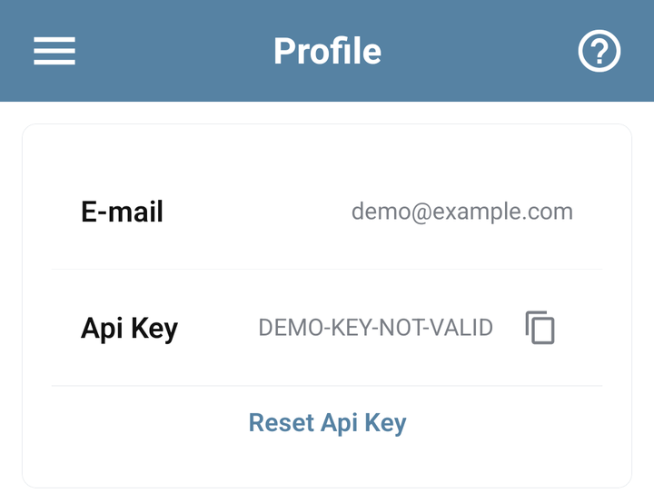
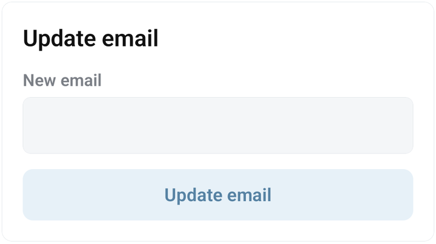

# Manage your profile and email

Open **Settings → Profile** to check the account you are using. Do this first if bots are missing or you are about to change account access.

<figure><figcaption>Profile with a demonstration email and an intentionally invalid example API key</figcaption></figure>

## Change your email

1. Find **Update email**.
2. Enter the new email address you control.
3. Tap **Update email** and wait for **Email updated**.
4. Check the email in the account details. Reopen Profile to verify that it was saved.
5. Use the updated email for your next email sign-in and password recovery.

The service trims spaces and normalizes the email to lowercase. An invalid address or one already in use is rejected. Read the error and check Profile before assuming a failed request changed anything.

Updating email changes the existing account; it does not move bots to a different account. The email form does not ask you to paste a Telegram bot token or reset the account API key.

<figure><figcaption>The Update email form with New email and Update email controls</figcaption></figure>

## Find the right access control

| Control | Use it for |
| --- | --- |
| **Update password** | Change a known password using the current password. See [passwords and recovery](password.md). |
| **Api Key** and its copy button | Configure an integration that uses account API access. The account key is different from a BotFather token. |
| **Reset Api Key** | Replace the account key. Update integrations that used the previous key. |
| **Active sessions / Log out of all devices** | End active app sessions, including the current one. |
| **Linked accounts / Add account** | Connect the intended Telegram identity to this account. See [linked accounts](linked-accounts.md). |

Keep API keys, passwords and generated connection links out of screenshots and public support messages. For [MCP](../integrations/mcp.md) or [VS Code](../integrations/vscode.md), follow that integration's connection instructions.

## If Profile does not load

Check the connection and try again. If the session is no longer valid, [sign in](../start/sign-in.md) using your existing account. A loading failure does not mean your bots were deleted.

For support, provide the failed step and error through **Settings → Support chat**. Use [password recovery](password.md) when you cannot sign in at all.
