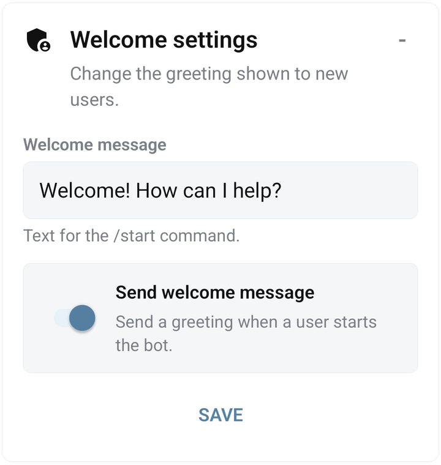

# Use a bot's Admin panel

An Admin panel is a form provided by the bot developer. It lets you change supported settings without editing the bot's BJS. The fields and their effects depend on that bot.

## Open and save a panel

1. Open the correct bot from **My bots**.
2. Select **Admin panel** in the workspace tabs.
3. Tap the panel's heading to expand its fields.
4. Enter or select the values you need. Check the field labels and descriptions supplied by the developer.
5. Tap that panel's save button and wait for **Saved**. The developer chooses the button label; the example below uses **SAVE**.
6. Reopen or refresh the panel, then test the relevant behavior in Telegram.

If several panels are shown, save the panel you changed. The saved form and the resulting bot action are separate checks: a bot may run additional code after saving.

<figure><figcaption>An expanded demonstration Welcome settings Admin panel with a text field, switch, and SAVE button</figcaption></figure>

## “No Admin Panel yet”

This bot has no renderable panel available. Opening the tab does not create a standard settings form automatically.

- If you installed the bot, follow its setup instructions or contact its developer.
- If you build the bot, [create an AdminPanel with BJS](../bjs/admin-panel.md).
- If a panel existed before, confirm the selected bot and refresh the data.

## Saved settings do not change the bot

Check that you changed the correct panel and completed Save. Then open **Errors**: the developer may have configured an `on_saving` command that failed after the form was stored.

For your own BJS, use the documented [AdminPanel field-reading methods](../bjs/admin-panel.md). The names of fields in code must match the panel definition.

## Protected bots

A [protected bot](../account/protected-bots.md) can provide an Admin panel even when command editing is unavailable. Use the controls its developer exposes; protection does not make visible panel values suitable for storing the developer's private credentials.

Next: [inspect stored properties](properties.md) or [read execution errors](../troubleshooting/errors.md).
