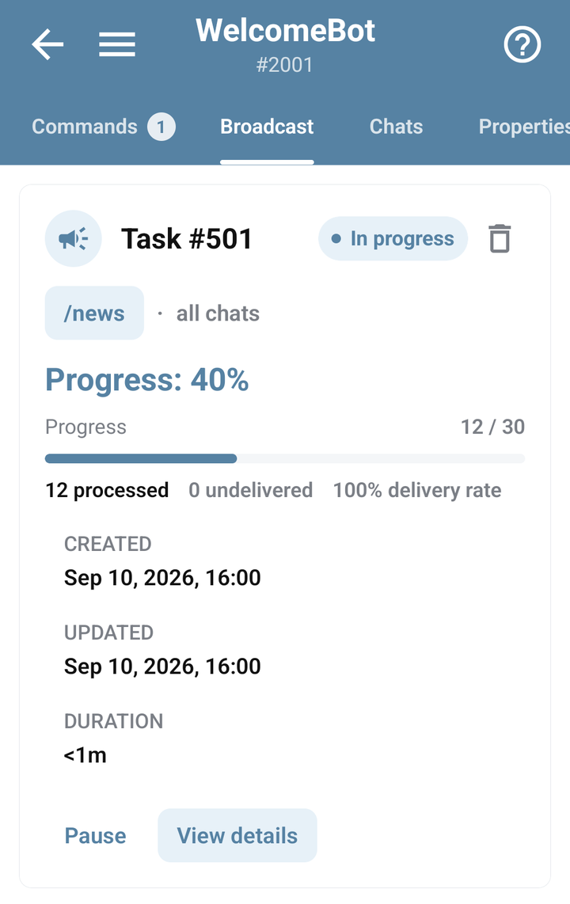

# Monitor a broadcast

Open your bot → **Broadcast** to inspect its broadcast tasks. This screen tracks existing work; the BJS [broadcasting guide](../bjs/broadcasts.md) explains how to create that work.

Before a real broadcast, test the sending command in a controlled chat. Check the intended audience and the message content, especially links and formatting.

## Open task details

1. Find the task by its command, creation time, and status.
2. Choose **View details**.
3. Read **Audience** and **Delivery**, then check progress and recent updates.
4. Refresh before deciding whether the task has stopped progressing.

## Understand the counters

| Counter | What to look for |
| --- | --- |
| Available recipients | The audience currently counted for this task. |
| Blocked/excluded | Chats not available under the task's eligibility rules. |
| Processed | Work already processed; this is not the same as successful delivery. |
| Delivered | Reported successful deliveries. |
| Failed / undelivered | Attempts that did not produce a successful delivery. |
| Pending | Work still to be processed. |

While the audience is being counted, the screen can show **Counting recipients**. Wait for the count before interpreting its totals. A completed task can still have failed deliveries: completion describes the task's progress, not universal delivery.

## Pause, resume, or remove a task

Use **Pause** or **Run** when the action is available for that task. Check its status again afterward. Review the task before deleting it; deletion is not a way to recall messages that were already delivered.

For a bulk deletion, inspect the selection and check the result for each task.

## Investigate failed delivery

Check whether the recipient blocked the bot, the chat is excluded, or Telegram rejected the message. Inspect **Errors** for related failures. Sending again without understanding the failure can waste [iterations](../account/iterations.md) and duplicate messages for recipients who already received them.

If a task remains pending, check bot status, iteration availability, and the sending command's background context. See [background execution](../bjs/background.md) and [performance troubleshooting](../troubleshooting/performance.md).
