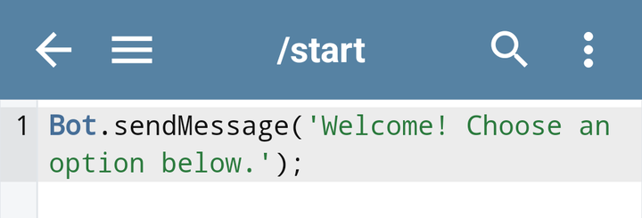
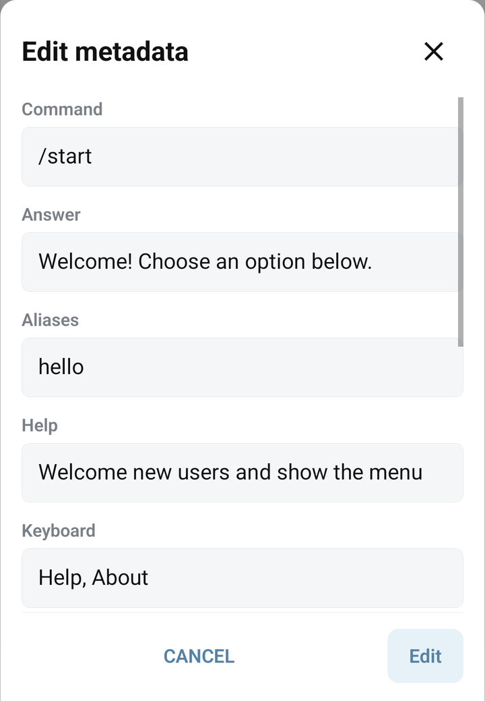

# Create and edit commands

A command defines what your bot does when it receives matching text or when another part of the bot runs that command. It can send an Answer, show a keyboard, or execute BJS.

## Create a command on your phone

1. Open your bot → **Commands**.
2. Tap **+** → **New command**.
3. Enter **Command**, such as `/help`, and **Answer**, such as `Choose a topic from the menu.`
4. Tap **Create**. For an existing command, use **⋮ → Edit metadata** and tap **Edit** after changing its fields.
5. Launch the bot if needed and send `/help` in Telegram.

The editor's code area contains BJS. **Save** writes the current metadata and code. If you navigate away with unsaved changes, handle the save prompt before assuming your changes are active.



## What the fields do

| Field | Meaning |
| --- | --- |
| **Command** | The command text, usually `/start`, `/help`, or a short internal name. |
| **Answer** | A message sent when the command is triggered. |
| **Aliases** | Alternative names, separated by commas: `Help, /support`. |
| **Help** | A description used by the bot's help behavior. |
| **Keyboard** | Reply-button labels separated by commas; `\n` starts another row. |
| **Allowed only for group** | Restrict execution to a named Bots.Business user group. |
| **Wait for answer** | Send the prompt first and run the BJS after the user's reply. |
| **Auto retry time in seconds** | Run BJS periodically without user/chat context. Follow the [complete Auto Retry setup](../bjs/background.md#auto-retry-run-periodically), including an explicit destination and how to stop it. |
| **Select Folder** | Organize the command in the app; a folder is not a permission group. |

A Keyboard requires an Answer in the metadata form. An auto-retry interval requires BJS. The editor reports these combinations when you save.



## Names, aliases, and parameters

Use consistent lowercase command names such as `/help`. Main command names are matched exactly, so `/start` and `/START` can differ. Aliases are trimmed and normalized to lowercase; they provide a convenient way to connect a button labelled `Help` to `/help`.

For a command `/product`, an incoming `/product blue` can expose `blue` as BJS `params`. Define the `/product` command, then handle the parameter in its code. Avoid conflicting command names and aliases.

The special commands `*`, `@`, `@@`, and `!` have runtime roles. Read [execution context and special commands](../bjs/context.md) and [BJS errors](../bjs/errors.md) before using them.

## Format a simple Answer

Answer messages use the Telegram sender's default Markdown formatting. Start with ordinary text, then add simple formatting:

```text
*Welcome*
Choose /help to see the available commands.
[Visit our website](https://example.com)
```

Unmatched formatting characters can cause a Telegram error. A Markdown link to an image is a link; it is not a reliable replacement for sending a photo. Use a suitable [Telegram API method](../bjs/telegram-api.md) when you need a photo, document, or explicit parse mode.

## Restrict a command to a group

The group field refers to a Bots.Business user group, not to a Telegram group chat. Assign group membership through [User methods](../bjs/user-properties.md), then put that same group name in the command's **Allowed only for group** field. A command without a group restriction is not restricted by this field.

## Find and organize commands

Use search, folder selection, and feature filters such as **Has code**, **Has keyboard**, or **Wait for answer**. **Folder manager** organizes the list. If a command appears to be missing, clear search and filters before recreating it.

## Editor tools

- **Check** checks syntax. It does not prove that an API method exists or that a request will succeed.
- **Format** formats the current code draft; save the result when ready.
- **Search code** opens find and replace within the current command.
- **Undo** and **Redo** work on the current editor draft.

Next: [reply keyboards](reply-keyboard.md), [collecting input](collect-input.md), [background work](../bjs/background.md), or [importing commands](../integrations/google-table-import.md).
