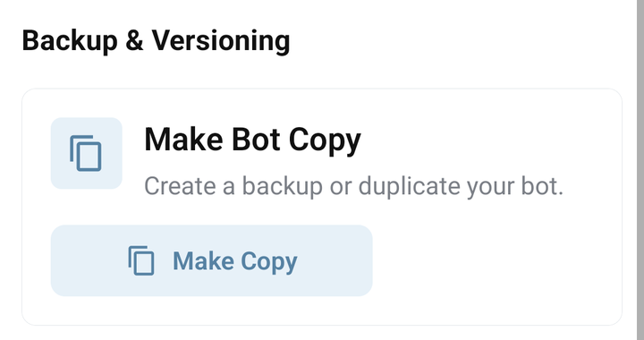

# Make a copy of your bot

Use a copy to experiment with commands before changing your working bot. **Make Bot Copy copies the implementation; it is not a complete backup of the bot's users and stored data.**

## Create the copy

1. Open the source bot and check its name.
2. Open **Tools** and find **Backup & Versioning → Make Bot Copy**.
3. Tap **Make Copy** and read the result.
4. Return to **My bots** and refresh. Copying runs in the background, so the new entry may appear after the request is accepted.
5. Find **Cloned bot: …**, open it, and check its commands and libraries.

<figure><figcaption>The Make Bot Copy screen for a demonstration bot</figcaption></figure>

## What is copied?

| Item | Make Bot Copy |
| --- | --- |
| Commands, answers, BJS, aliases, permission-group names, Wait for answer and folder organization | Copied to the new bot. |
| Installed libraries | Available libraries are reinstalled. An unpublished library owned by someone else can be skipped; compare the library lists. |
| Telegram bot token | Not copied; configure the new bot separately. |
| Existing users/chats and their stored properties | Not copied. |
| Ordinary bot properties and saved Admin Panel values | Not transferred as a general data backup. Run required library setup separately. |
| Auto Retry intervals | Copied with command metadata; review them before launching the copy. |
| Pending requests, delayed work and broadcast jobs | Not copied. |
| Git and spreadsheet connection settings | Configure separately. |
| Running state | The copy is not automatically launched. |

The text of a command can still contain IDs, URLs or credentials copied from the source. Review those values before running the copy. A copied permission-group name does not copy the users' memberships.

## Configure a test bot

[Create a separate Telegram bot and get its token from @BotFather](../start/first-bot.md#1-create-the-bot-in-telegram), then add that token through **Dashboard → Edit bot** in the copy. Reusing the working bot's token can make two projects compete for the same Telegram bot.

Set up the copy's properties and Admin Panel, check external integrations and scheduled commands, and test with your own small set of example data. Then launch the copy and send its commands in Telegram.

If you need to preserve source outside Bots.Business, use [Git export](../integrations/git.md). Keep a separate, deliberate plan for any user data you need to preserve; a code export and a project copy do not establish a full data restore.

## If the copy does not appear

Refresh My bots, clear filters, and check that you are still in the same account. Allow the background operation to finish before making repeated copy requests. Report the source bot ID and time if it remains missing.

The app does not allow copying a [protected bot](../account/protected-bots.md). Use its developer's supported installation and configuration path.
