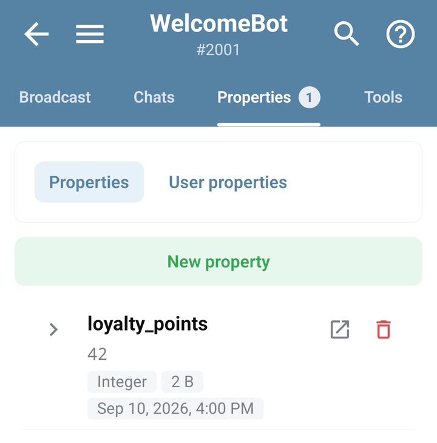
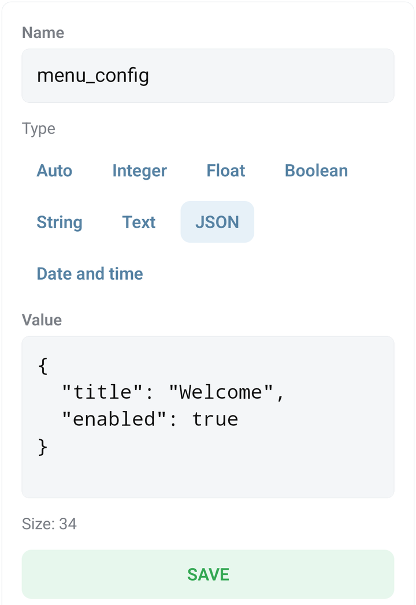
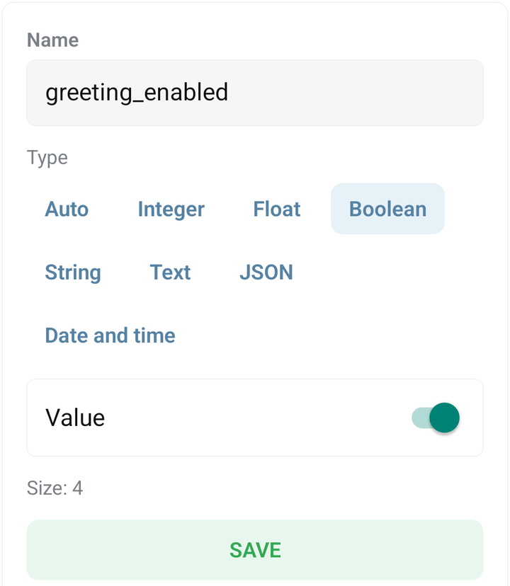

# Inspect and edit stored properties

Properties are named values that a bot keeps between command executions. A value can belong to the bot or to one of its users. Check the scope before changing it: two properties can have the same name but belong to different users.

## Find a property

Open the bot → **Properties**. Use the available scope controls, name search, and type filter to narrow the list. Expand a value or group to inspect its details.

To inspect one known user, open **Chats**, find the user's chat, and tap **Properties**. This provides the user context instead of making you guess an internal ID.

<figure><figcaption>The mobile Properties screen with demonstration bot values</figcaption></figure>

## Create or edit a value

1. Open the intended bot or user property list.
2. Add a property or open an existing one.
3. Enter **Name**, choose **Type**, and enter **Value**.
4. Save, reopen the property, and check that its stored value matches your intent.
5. Run the command that reads it to verify the result.

Use **String** for text such as a display name, **Integer** for a whole-number counter, and **Boolean** for a true/false setting. Use **JSON** for structured data only when the consuming code expects it. The form rejects values that do not match its selected type.

For example, the [name question](collect-input.md) writes a user property named `display_name` with type `string`. Look for it under the user who answered, not under bot-wide properties.

<figure><figcaption>The JSON property form with a demonstration structured value and Save</figcaption></figure>

<figure><figcaption>The Boolean property form with its value switch and Save</figcaption></figure>

## Choose the scope deliberately

| You need to store | Typical scope |
| --- | --- |
| A setting shared by the bot | Bot property |
| One user's name or progress | User property |
| A collection of entries read in pages | A [List](../bjs/lists.md), with its documented scope and query limitations |

Changing a value's type or deleting it may affect commands that expect the original data. Keep a copy of an important value before editing it manually.

## Delete a property

Open the property and use **Delete**, then confirm its name. For a selection of properties, inspect the selection before confirming the bulk action. Check the list again after the operation; a failed request does not prove the data was deleted.

## When the value seems wrong

- Clear search and type filters if the property is missing.
- Check the selected bot and user, and refresh after a BJS write.
- Check spelling and type against the BJS that reads the property.
- Distinguish a missing value from a stored `0`, `false`, or empty string; see the getter behavior in [the properties reference](../bjs/user-properties.md).

Properties visible to a bot owner are not a hiding place for credentials you need to keep from that owner. See [protected bots](../account/protected-bots.md) and [BJS security](../bjs/security.md).
