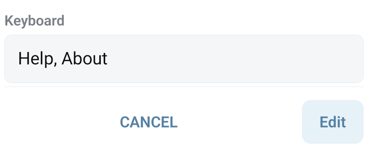

# Add buttons with a reply keyboard

A reply keyboard shows labelled buttons in the Telegram chat. Tapping a text button sends its label to the bot. Create matching commands or aliases so the bot knows what to do with that text.

## Build a two-button menu

1. Create `/help` with Answer `Tell us what you need help with.` and Aliases `Help`.
2. Create `/about` with Answer `This bot helps you find our services.` and Aliases `About`.
3. Open `/start` → **⋮ → Options** to edit its metadata.
4. Set Answer to `Choose an option:`.
5. Set Keyboard to `Help, About` and save.
6. Send `/start` in Telegram and tap **Help**. The `/help` answer should appear.


The button labels and aliases must represent the same text. Include any emoji in the alias too, for example `ℹ️ About`.


<figure><figcaption>The Keyboard field in the current command metadata form</figcaption></figure>

## Put buttons on separate rows

Separate labels with commas and use the literal `\n` sequence to start a row:


```text
Help, About\nContact
```


Create a command or alias for `Contact` before testing the third button. The Keyboard field is intended for this simple text layout; use BJS for structured buttons or advanced options.

## Show a changing balance on a button

A reply button contains text, so its displayed balance is a snapshot. Send a new keyboard after the balance changes. Read the actual resource when the button is pressed: users can type or edit the label themselves.

Create these commands with empty **Answer** and **Keyboard**, and **Wait for answer** off. Keep `/help` with its `Help` alias from the first example.

Command `/wallet`:


```javascript
if (!user) { return; }
const points = ResLib.userRes("demoPoints").value();
Bot.sendKeyboard(
  "Balance " + points + " points, Help",
  "Your balance: " + points + " points.",
  { parse_mode: null }
);
```


Create a command named **`Balance`**, without a slash or spaces:


```javascript
// Command: Balance
// params is the rest of the label, such as "3 points".
// Read the saved balance by opening /wallet; do not trust that text.
Bot.runCommand("/wallet");
```


When Telegram sends `Balance 3 points`, the command name is `Balance` and `params` is `3 points`. An alias for a whole label is unsuitable when that label keeps changing; the stable first word here is an actual command name.

For an example counter, create `/demo-add-point`:


```javascript
if (!user) { return; }
ResLib.userRes("demoPoints").add(1);
Bot.runCommand("/wallet");
```


Test `/wallet`, then `/demo-add-point`: the new keyboard should show the increased value. Tap **Balance … points** to refresh it. Typing `Balance 999999 points` must still show the saved value. These `demoPoints` are an example counter; use your own earning rules for a real balance. See [resources](../libraries/resources.md).

## Reply keyboard or inline button?

Use a reply keyboard for text choices. Use [inline buttons](../bjs/bot.md) when the action belongs underneath a particular message, such as a callback or a website link. Inline query mode is another feature; see [inline bots](../bjs/inline.md).

## If it does not work

- **No keyboard:** give the command an Answer, save, and send the command again.
- **A label appears but the wrong answer runs:** inspect matching aliases and any `*` command.
- **The bot is waiting for input:** a known command can cancel that wait. Check the flow in [Collect user input](collect-input.md).
- **An old keyboard remains:** send a new keyboard or use the keyboard-removal option described in the [Bot reference](../bjs/bot.md).

Next: [ask a question and save the reply](collect-input.md).
