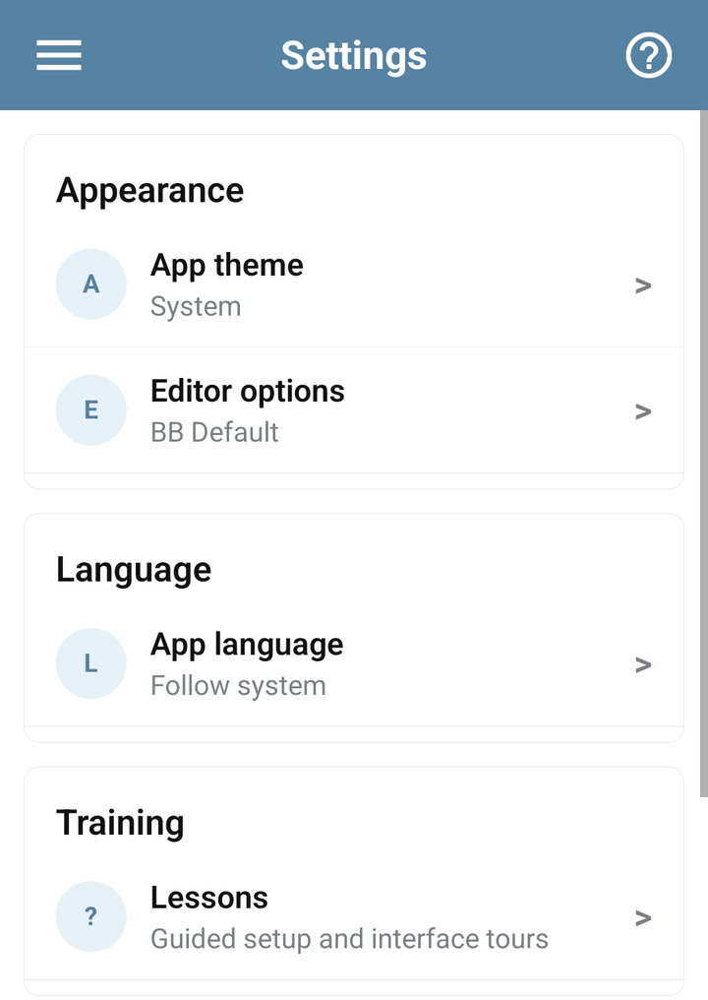
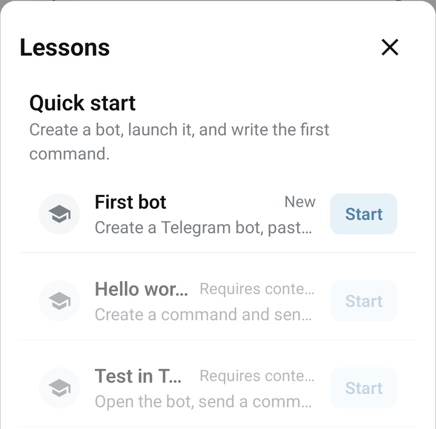

# Use settings and interactive lessons

Open **Settings** from the app menu. Settings changes how you work in the app; saved bot messages and BJS keep their own content and behavior.

## Make the app comfortable to read

- **App theme:** choose the appearance you prefer. The system option follows the device's appearance.
- **App language:** choose the interface language or follow the system language. To translate messages sent by your bot, use [Lang](../libraries/language.md) or a [SmartBot language menu](../guides/smartbot-menu.md).
- **Editor options:** choose a code color scheme using the preview. Return to a command to see it in the editor. Changing colors does not change or format the code.

The keyboard-shortcut settings available on desktop are not part of the phone's Settings screen. On mobile, use the editor's visible actions.

<figure><figcaption>Mobile Settings for theme, language and editor appearance</figcaption></figure>

## Start a lesson

1. Open **Settings → Lessons**. On a bot or command screen, its **?** help control can also offer relevant guidance.
2. Choose a lesson for your current task.
3. Tap **Start**, or **Resume** for a lesson already in progress.
4. Follow the highlighted control and instruction in the app. Some steps ask you to perform the action before continuing.
5. Return to Lessons to check progress or use **Restart** when you want to repeat a lesson.

Practice editing lessons in a test bot. A lesson that asks you to create or save something uses the app's real controls.

<figure><figcaption>Lessons on Android, with First bot available and other lessons requiring context</figcaption></figure>

Why does a lesson say “Requires context”?

## Why does a lesson say “Requires context”?

Some lessons need a selected bot or command. Open the bot you want to work on, and open a command for an editor lesson. Then open the help control or Lessons again.

Check that the bot supports the lesson's actions. For example, a [protected bot](../account/protected-bots.md) may not allow command editing. Restarting a lesson does not remove that restriction.

## Resume or reset progress

**Resume** continues an unfinished lesson. **Restart** starts that lesson again. **Reset progress** clears the app's lesson progress so you can begin again; it does not undo commands or other bot changes you made during lessons.

Use **Hide startup prompt** if you want to dismiss the training invitation. You can still open Lessons from Settings.

## Find help and version information

Settings also links to the help center, support chat, news, service status and API documentation. The **About** section shows the app version and build; include these when reporting an interface problem.

For account email, passwords and API access, open [Profile](../account/profile.md). For command editing actions, use [Create and edit commands](commands.md).
