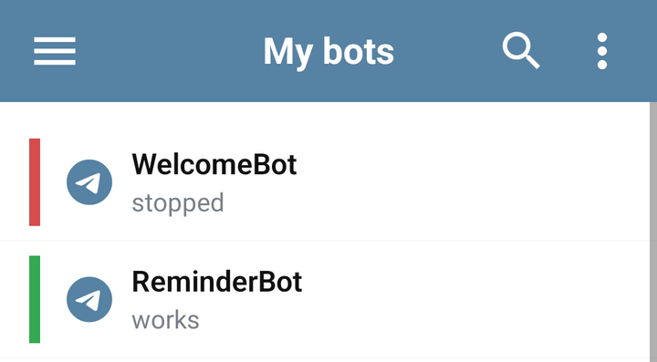

# Find your bot and its tools

Open **My bots**, then tap a bot to enter its workspace. Check the bot name before changing commands, settings, or data.

## Find the right bot

Use the search to narrow the list by name. Sort and filter controls help find working bots, stopped bots, or bots without tokens. Clear the active filters if a bot seems to be missing.

The list also supports selecting several bots for run/stop or deletion. Review the selected names before confirming a bulk action: deleting a bot is different from stopping it.

## Choose a workspace tab

| Tab | Use it to |
| --- | --- |
| **Dashboard** | Check status, launch or stop, edit name/token, and open the bot in Telegram. |
| **Commands** | Create answers and BJS, find commands, and organize folders. |
| **Libraries** | Inspect and manage the libraries installed in this bot. |
| **Admin panel** | Fill the management forms provided by the bot developer. |
| **Properties** | Inspect and edit stored bot or user data. |
| **Chats** | Find known chats, block/unblock them, and open user properties. |
| **Broadcast** | Inspect broadcast tasks, audiences, delivery, and progress. |
| **Errors** | Read execution errors and jump to the related command. |
| **Tools** | Import commands, work with Git, and use the available bot tools. |

On a narrow screen, some tab names can be outside the visible part of the tab strip. Scroll the strip to find the remaining tabs. Selecting a tab keeps you within the current bot.

## Launch, stop, and edit

Use **Dashboard → Launch bot** or **Stop bot**. Wait for the status result; a network failure can leave the action unconfirmed. **Open** takes you to Telegram, while **Edit bot** changes the Bots.Business bot configuration.

Stopping and deleting serve different purposes. Stop a bot when you need to investigate behavior; delete only when you no longer need its stored configuration and data.

## App settings and your account

Open **Settings** for the app theme, language, editor options, lessons, and support links. **Profile** contains account details, passwords, API access, sessions, and linked Telegram accounts.

App language and editor colors affect your interface. They do not translate saved bot messages or change how BJS executes.

If editing controls are unavailable, check [protected bots](../account/protected-bots.md). To learn the current interface interactively, open **Settings → Lessons**.
