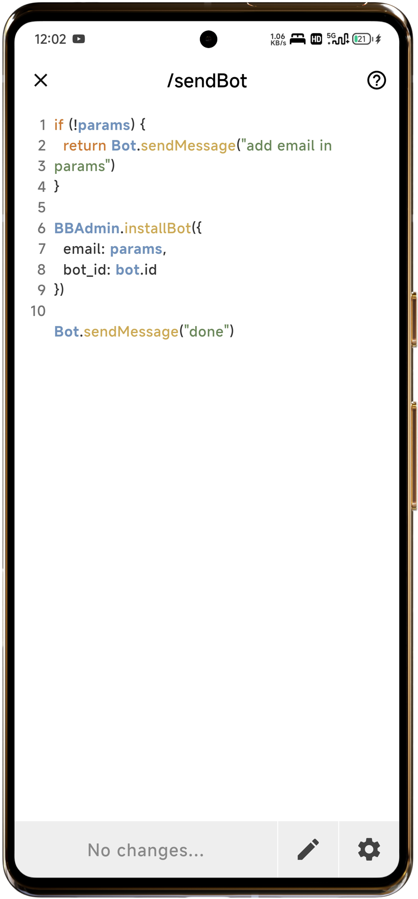
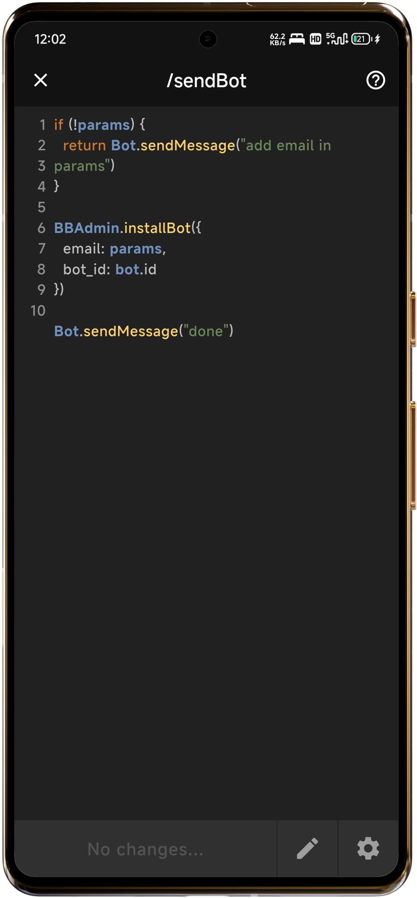

# BJS Code Editor

The **BJS Code Editor** is a simple code editor which has very useful and required tools. [ [Know about bjs](bjs) ]

---

## Features of the BJS Code Editor  

The **BJS Code Editor** is packed with features that streamline the bot scripting process. Here’s a detailed look at its key functionalities:  

### 1. Scripting Made Easy  
The editor provides a clean and distraction-free environment for writing code. Developers can create scripts for commands directly using the familiar syntax of BJS.  

### 2. Modifying Commands  
The **pencil icon** within the editor opens an input field where developers can easily modify existing commands. This feature makes it simple to edit the command without leaving the code editor.
[Read Here](commands) to know more about command editing.

### 3. Settings Button Functionalities  
The settings button in the editor provides essential tools to enhance productivity:  
- **Check Code:** Automatically validate your script to identify and fix any syntax errors, ensuring that your bot performs flawlessly.  
- **Copy Code:** Copy the entire code snippet with a single click, making it easy to share or reuse your scripts elsewhere.  
- **Format Code:** Beautify your code by formatting it into a clean, structured layout for better readability and maintenance.  
- **Destroy Command:** Permanently delete commands that are no longer needed, helping you keep your workspace organized and efficient.

### Bright screenshot 
 

### Dark screenshot 

