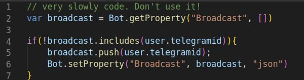

# Top errors

## 1. Cannot read properties of null

The `Cannot read properties of null` error occurs when you try to access a property or call a method on a value that is `null`. Since `null` represents the absence of any object value, trying to access properties or methods on it will result in this error.

**Accessing a Property of `null:`**

```javascript
let product = null;
// Error: Cannot read properties of null (reading 'tirle') here:
Bot.sendMessage(product.title);

```

Calling a Method on `null:`

```javascript
let data = null;
// Error: Cannot read properties of null (reading 'toString')
Bot.sendMessage(data.toString());

```

### **How to Fix It**

**Check for `null` before Accessing Properties or Methods** Before attempting to access properties or methods, you should verify that the variable is not `null`.

```javascript
let product = null;
if (product) {
    Bot.sendMessage(product.name);
}
```

**Use Optional Chaining**

Optional chaining provides a concise way to handle `null` or `undefined` values. If the value is `null` or `undefined`, it will return `undefined` instead of throwing an error.

```javascript
let product = null;
Bot.sendMessage(product?.title);
```


We can have null user, chat in [BeforeAll](always-running-commands.md), Master commands, webhook and etc. so you need to check this too.



## 2. JS syntax error

### **Common Causes and Recommendations**

Syntax errors in JavaScript occur when the code does not follow the correct syntax rules of the language. These errors prevent the code from executing and typically happen due to simple mistakes. Here are some common causes and tips to avoid them:

1. **Missing or Misplaced Brackets**
   * **Cause**: Forgetting to close curly braces `{}`, square brackets `[]`, or parentheses `()`.
   * **Recommendation**: Always ensure that every opening bracket has a corresponding closing bracket. Tools like linters or code editors with syntax highlighting can help spot these errors.

```javascript
if (condition {
    // code block
} // Missing closing parenthesis and curly brace
```

2. **Unterminated Strings**

* **Cause**: Forgetting to close a string with a quotation mark.
* **Recommendation**: Make sure every string that starts with a single `'`, double `"`, or backtick `` ` `` quote has a corresponding closing quote.

```javascript
let message = "Hello World; // Missing closing quote
```

3. **Using Reserved Keywords**

* **Cause**: Trying to use reserved keywords like `class`, `return`, or `if` as variable names.
* **Recommendation**: Avoid using reserved keywords as identifiers in your code.

```javascript
let return = 5; // Invalid variable name
```

4. **Missing Semicolons**

* **Cause**: Forgetting to add a semicolon `;` at the end of a statement can sometimes lead to unexpected results.
* **Recommendation**: While JavaScript often automatically inserts semicolons, it's good practice to manually add them to avoid subtle bugs.

```javascript
let x = 5
let y = 10 // Missing semicolons may cause issues
```

5. **Uninitialized Variables**

* **Cause**: Using a variable before declaring it.
* **Recommendation**: Always declare variables using `let`, `const`, or `var` before using them in your code.

```javascript
Bot.sendMessage(name); // ReferenceError: name is not defined
let name = 'John';
```

6. **Incorrect Operator Usage**

* **Cause**: Mixing up assignment `=` with equality `==` or strict equality `===`.
* **Recommendation**: Use `=` for assignments and `==` or `===` for comparisons. Prefer `===` for strict equality checks.

```javascript
if (x = 5) { // Mistakenly used assignment instead of comparison
    // Always true, since x is assigned 5
}
```


## 3. Prop size is limited. #WholeUsers issue


We have limit on data saving on prop. It is approx 10K.

So if save much more data your code will be broken.


Bad code examples:

```javascript
var fullBotUsers = Bot.getProperty("wholeUsers")
for (var index in fullBotUsers) {
  var info = fullBotUsers[index]
  // other logic here
  // ...
```

or:&#x20;

<figure><figcaption></figcaption></figure>

and etc.

### How to Fix it

Remove this code. Use [Bot.runAll](message-broadcasting.md#do-you-want-broadcast-text-to-all-chats) for broadcasting or use [List](lists/) or another logic.


## 4. Can not edit/remove message

On message editing, removing we can have this error.

It is possible on:

* chat was deleted already (user can delete chat with bot in any time). So it is not possible to edit or remove old message if chat deleted
* bot is restricted on chat and can't edit/remove message. Check bot permissions
* message\_id is incorrect - check it
* chatid is incorrect - check it (you need to use chat.chatid not chat.id)
* it is not possible edit message with same text. Use another text for editing
* Text for editng can be very big - check this


## 5. Incorrect file for sending.

If you want to send video with Api.sendVideo or photo with sendPhoto and etc - you need to use direct file link.&#x20;

Incorrect links examples:

* YouTube video link - it is web page with video. Not just video
* Message link with video or with picture. It is message
* incorrect file format. For example, Telegram don't support SVG or something video specific formats


## 6. JSON parsing error: Unexpected Token in JSON

Check that your data is JSON before

You can have here:

* html page not JSON. If you use external Api this Api can response with html on errors.
* blank text
* something else

If you use JSON.parse() method you need check that it is really json data before parsing. &#x20;
