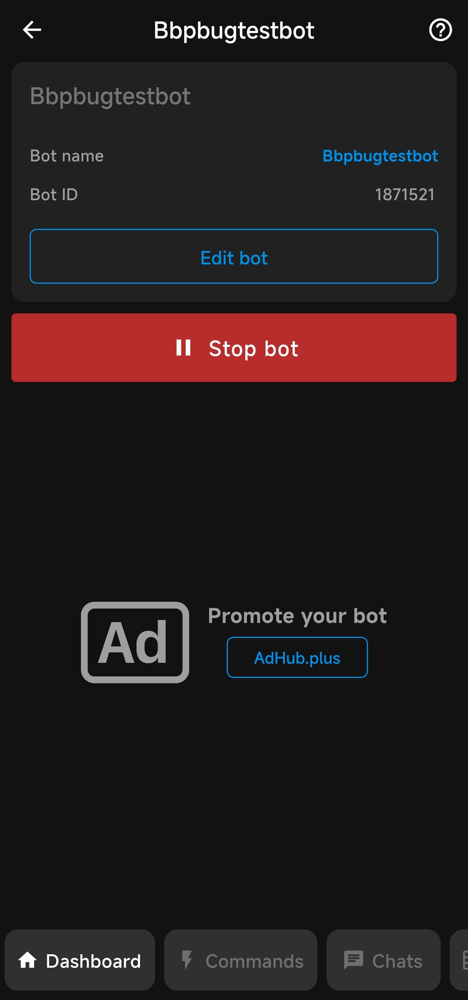
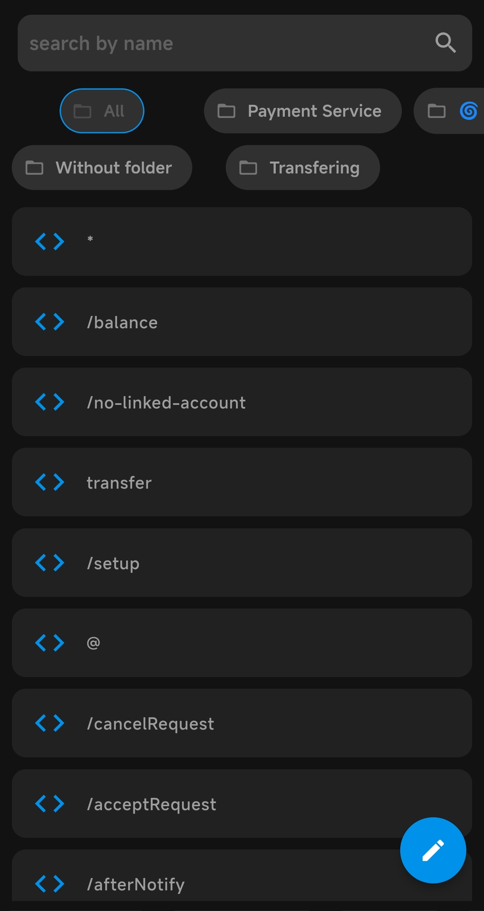
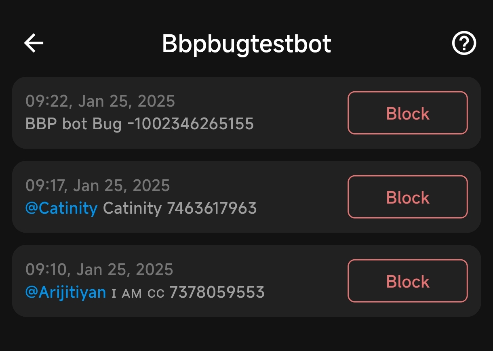
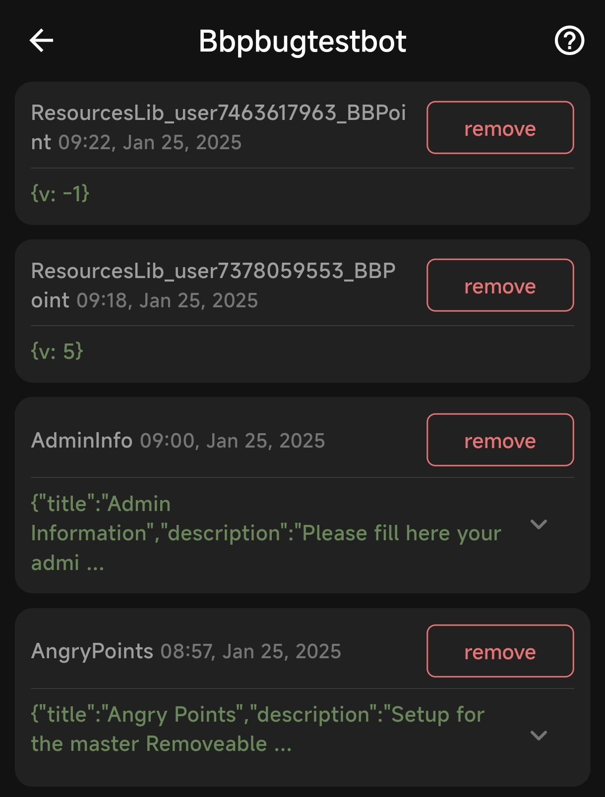
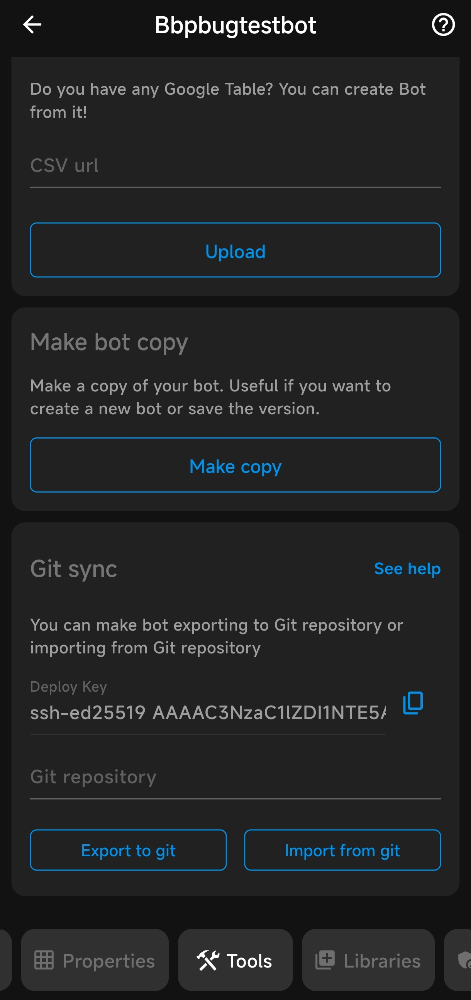

# Bot dashboard and Profile

This document provides an overview of the bot dashboard in the Bots.Business (BB) application. After selecting a bot from the homepage, the dashboard appears with various options for managing and developing your bot.

## Bot Identification

- **Bot Name**: The name of the bot is displayed at the top of the dashboard.
- **Bot ID**: A unique identifier for the bot is also displayed.

## Bot Management Options

- **Edit**: You can edit name or bot token, click on the edit button then you'll be redirected to the editing page.
- **Stop/Launch**: You can stop or launch the bot directly from the dashboard.

## Navigation and custmization

The bottom of the dashboard contains several important buttons for bot development, below the list of navigation buttons and theor purpose.

### Dashboard
This is the current page displaying the bot details, including the bot name, bot ID, and options to edit the name, token, and stop/launch the bot.

### Commands
This page contains the commands and folders of your bot. You can create new commands or edit existing ones. Commands can be organized into folders for better management.

 - You can also search commands, very helpful feature for big bots. you can find search bar at the top of the page.

### Chats
This page shows the list of your bot chats, including groups, channels, and private chats. This is important for further actions like running commands for all users or for a specific user, blocking users, or blocking a chat from using the bot. You can also block them manually from the list by clicking the "Block" button for the chat. You can add blocking logic and functions using Bjs code.

### Property
This page provides a full list of properties (data) saved by your bot for users or the bot itself. You can view and manage these properties. Property can be delete manually using the "Remove" button on this page and property can be saved using bjs (code) only, [Learn more about property saving here](bjs/properties.md).

 Please note that removing property manually isn't working currently due to an unknown bug. only resources property can be removed manually now. 

### Tools
This section includes interesting and helpful functions. You can import commands from Google Sheets, copy an existing bot, and import or export bots to GitHub. [Read Here](bot-tools.md) to know more about the tools section.

### Libraries
This page shows a list of libraries installed on your bot. You can install a new library by clicking the "Go to Install" button. [Read Here]() to know more about libraries and their usage.

### Admin Panel
This page works as an admin panel where you can create and customize the admin interface. It is a secure way to store sensitive information like API keys or payment options. [Read Here]() to know more about creating and managing the admin panel.

### Errors
This page helps you track errors in your bot. You will get detailed error messages with a button to redirect to the command where the error occurred. The error page also provides information about the line where the error occurred. [Read Here]() for common errors and join our official chat group for further assistance.

For further assistance, please refer to the official documentation or contact support.
