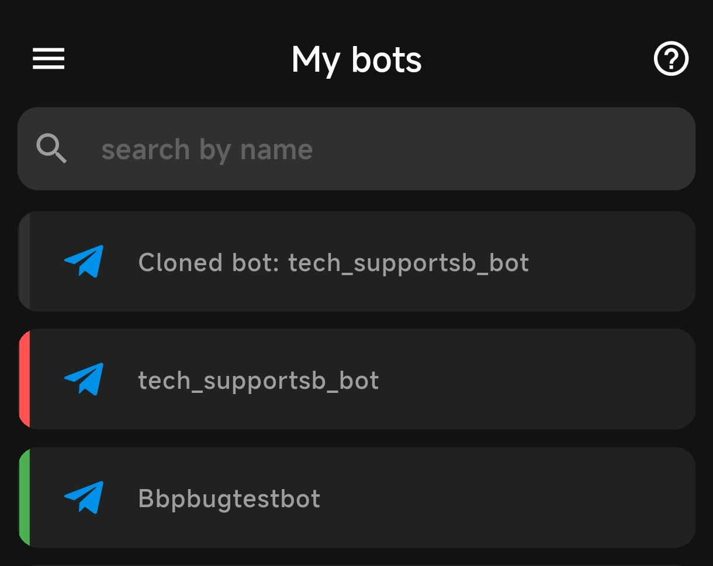
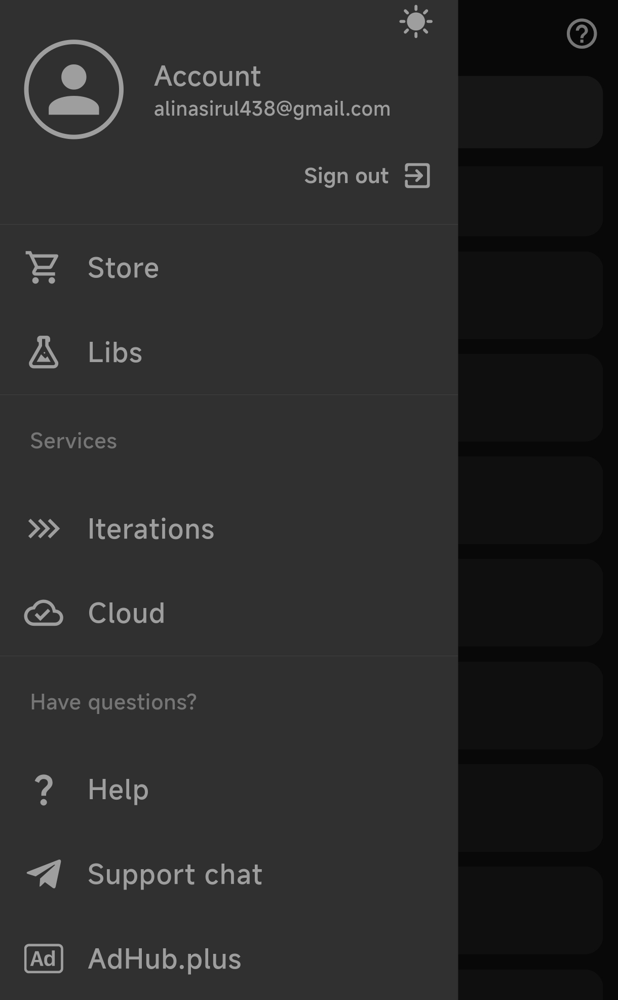

# Managing Your Bots:
This is home screen where all bots that created by you or transfered to you from other account will be listed here.
Lets understand the bot menu and its functionality.

---

## Table of Contents

1. [Bot List Overview](#bot-list-overview)
2. [Actions](#actions-you-can-take)
3. [Searching Bots](#searching-bot)
4. [Hamburger Menu (☰)](#hamburger-menu)

---

## Bot List Overview

When you access the bot management interface, you'll see a comprehensive list of all your bots. The bots are listed in a clear, organized manner, allowing you to easily navigate between them. Additionally, each bot has a colour indicator  that informs you about the bot's current state, helping you keep track of which bots are active or need attention.

 #### Understanding status indicator -
Each bot in your list has a **color-coded status indicator** to show its current state:

- **Green Indicator**: The bot is active and currently running without any issues.
- **Red Indicator**: The bot is inactive or stopped, can be stopped by you or insufficient **[iteration](iterations.-how-to-reduce-theys.md)** 
- **No Indicator (No Color)**: This indicates the bot hasn't been launched yet or is awaiting further action. Typically, these are bots in development, just copied or **[transfered](bjs/bb-admin-functions.md#bbadmininstallbot)** from other bb account or not yet activated.

These indicators allow you to monitor the health of your bots at a glance, helping you prioritize which bots need immediate attention.

## Actions You Can Take

When you tap on any bot in the list, it will open the Dashboard of the bot. You can perform several actions from bots dashboard like edit, important from third parties and more, please read [This Article](bot-dashboard.md) for detailed information about bots dashboard.

## Searching Bot

At the top of the Page, you'll see a search field. for big number if bots it us hard to find the bot you're looking for but the search function make it easier, just type the name if your bot on yhe search bar to get the bot at the top of the list. you can rename any bot and assign a custom name then search using the custom name you set, please [Read Here](bot-dashboard.md) for rename and more about bot settings.

## Hamburger Menu

The **Hamburger Menu** (three horizontal lines) in the top-left corner of the screen provides access to additional options and advanced features including dark and bright mode toggle:

- **Account Information**: View your account details, including your email address, profile picture, and lots if security options inside profile page, please [Read Here](profile.md) for more detailed information about profile and security.

- **Store**: Access the bot store, where you can fnd demo bits created by community and BB, you can install any bot from there fo learning and understanding the logic. please [Read Here](store-bots.md) for more details about bot store.

- **Libs**: [Libs](libs/what-it-is-libs.md) are common functionalities that can be reused for any tasks you want to automate with your bot. Libs allow you to streamline and reuse code across multiple commands and functions. Please [Read Here](libs/what-it-is-libs.md) to know more about libs and usage.

- **Iterations**: Provides details on your current plan, remaining iteration and monthly quata, please [Read Here](iterations.-how-to-reduce-theys.md) for more details about iteration and usage.

- **Cloud**: [BB.Cloud](cloud.md) is your own server instance for hosting your bots. There are several monthly plans available, including **Nano**, **Mini**, **Start**, **Pro**, **Business**, and **Big Business**, each offering different levels of power to meet your needs. [Read Here](cloud.md) for more detailed information about each cloud plane and pricing.

- **Help & Support**: A shortcut to the help section and support chat, offering quick access to resources when you need assistance. feel free to join our [QNA Chat](https://t.me/chatbotsbusiness) for further assistance from our successful developers

- **AdHub.plus**: Tools and options for managing advertisements and promotions related to your bots. This feature helps you promote your bots to a wider audience. more information about is available on the official site: [Adhub.plus](https://adhub.plus)
