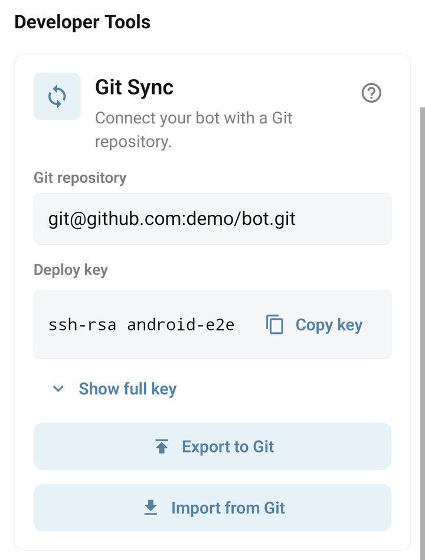

# Import and export a bot with Git

Git lets you keep bot commands and libraries as files. The mobile app starts export and import jobs; it does not continuously synchronize every edit by itself.

## Export a bot

1. Create a dedicated GitHub repository with an initial commit.
2. Open the bot in the mobile app: **Tools → Git Sync → Configure Git**.
3. Enter the **Git repository** URL.
4. Use **Copy key** to copy the bot's public SSH key. Add it to the repository as a deploy key; allow write access when exporting to Git.
5. Tap **Export to Git**, wait for completion, and check the resulting branch and notification email.
6. Review the exported files before making the repository public: library code and command source may contain your secrets.

Without an explicitly selected branch, the backend creates a branch named `BB_Export_<timestamp>`. It writes a complete bot export to that branch, removing unrelated working-tree files from the exported snapshot. Use a dedicated bot repository, not a repository containing another application.

Protected bots cannot be exported through this flow. See [Protected bots](../account/protected-bots.md).



## Import a reviewed repository

**Git import replaces all commands and the installed library list in the destination bot.** The current backend clears them before cloning and validating the repository; a failed import can leave the bot without its previous commands. Export a backup and test against a disposable bot first.

1. Check [the repository format](repository-format.md), especially `bot.json`, `commands/` and `libs/`.
2. Verify repository access and the branch you intend to use.
3. Open the destination bot's **Tools → Git Sync**, configure the repository and tap **Import from Git**.
4. Read the replacement confirmation and continue only for the intended destination.
5. Wait for the job, inspect the command and library lists, then test `/start` and the important callbacks in Telegram.

The mobile flow uses the repository's default branch. BJS `Bot.importGit({ branch: "main", success: "/import-done" })` can specify a branch. Successful submission of a task is not proof that every imported example behaves correctly.

## Deploy after a GitHub push

This is optional and needs a verified GitHub webhook. The old recipe that imported whenever a public command was invoked is not an access-control boundary.

1. Install `Webhooks` and create a command-specific URL as described in [Webhooks](../libraries/webhooks.md).
2. In the GitHub repository, open **Settings → Webhooks → Add webhook** and use that URL as the **Payload URL**.
3. Set **Content type** to **application/json**. When creating the webhook through the API, use `config.content_type: "json"`; the API defaults to form encoding, which this handler does not accept. See [GitHub webhook configuration](https://docs.github.com/en/rest/repos/webhooks#create-a-repository-webhook).
4. Set a webhook **Secret** and store that same value as the bot property `githubWebhookSecret` through the owner's app settings or a protected setup command. Do not put it in the URL or repository.
5. Select **Just the push event**, keep the webhook active, and save it. Use the callback below to verify the raw JSON body before requesting import:

```javascript
if (!options || options.method !== "POST" || typeof content !== "string") { return; }
const headers = options.headers || {};
if (headers["X-Github-Event"] !== "push") { return; }
const secret = Bot.getProp("githubWebhookSecret");
if (!secret) { return; }
const expected = "sha256=" + CryptoJS.HmacSHA256(content, secret)
  .toString(CryptoJS.enc.Hex);
const received = headers["X-Hub-Signature-256"];
if (typeof received !== "string" || received.length !== expected.length) { return; }
let difference = 0;
for (let i = 0; i < expected.length; i++) {
  difference |= expected.charCodeAt(i) ^ received.charCodeAt(i);
}
if (difference !== 0) { return; }
let event;
try { event = JSON.parse(content); } catch (error) { return; }
if (event.ref !== "refs/heads/main" ||
    !event.repository || event.repository.full_name !== "YOUR_OWNER/YOUR_REPOSITORY") {
  return;
}
Bot.importGit({ branch: "main", success: "/import-done" });
WebApp.render({ content: { accepted: true }, mime_type: "application/json" });
```

Replace the repository and branch with your actual values. In GitHub **Recent Deliveries**, check that a push delivery has `Content-Type: application/json` and a raw JSON body. A form body starting with `payload=` will be ignored even if its signature is valid; correct the webhook content type before testing again. Do not re-encode the body before signature verification. Keep the callback and `/import-done` commands in the imported repository, because import replaces the command set. A webhook acknowledgement means the request was accepted, not that deployment has finished. Review delivery IDs and serialize deployments in your automation if duplicate/concurrent pushes can trigger overlapping imports. GitHub describes its signature format in [webhook validation](https://docs.github.com/en/webhooks/using-webhooks/validating-webhook-deliveries).

## When an operation fails

Check repository URL, branch, deploy-key permissions and notification email. A missing or invalid `bot.json` prevents import. A non-GitHub SSH URL should not be assumed to support the same URL conversion/fallback behavior. After a failed import, inspect the destination immediately and restore from your reviewed backup if necessary.

For automatic upload when saving a local command file, see [VS Code](vscode.md). That is a different workflow from importing a complete Git snapshot.
