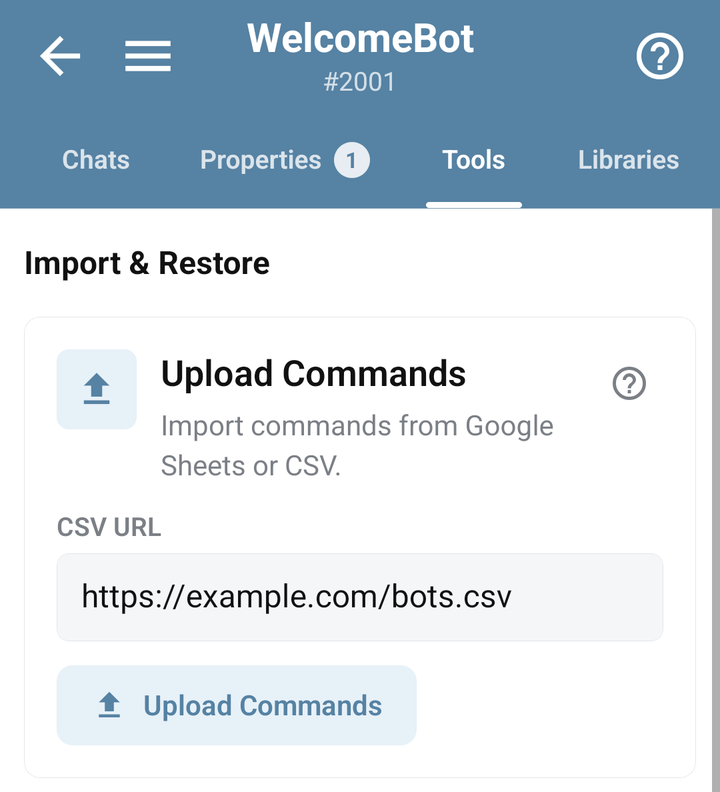

# Import commands from Google Sheets or CSV

Use a CSV when you want to maintain command names, replies and code in a table. Bots.Business downloads the CSV; it does not use your signed-in Google session.

This imports **bot commands**. To read or write business data in a spreadsheet while the bot runs, use [Google Apps Script](google-apps-script.md).

## Prepare a small table

Use exact lowercase column names. A minimal file is:

```csv
command,answer,aliases,help,keyboard,need_reply,scenarios
/start,Welcome!,/hello,Start the bot,/help,false,
/help,Send /start to begin.,,Help,,false,
```

`command` identifies the command. Optional columns include `answer`, `aliases`, `help`, `keyboard`, `need_reply`, `scenarios`, `group` and `runtime_mode`. BJS code goes in `scenarios`. Use `true` or `false` for `need_reply`; escape commas, newlines and double quotes according to CSV rules. Blank command rows are skipped.

Start with two simple replies. Add BJS and more complex keyboards after the first import works. Keep bot tokens, API keys and private user records out of a publicly downloadable table.

## Publish the correct CSV

In the Google Sheets browser interface, use **File → Share → Publish to web**, choose the specific sheet and CSV format, then copy the published URL. Some account administrators disable publishing; publishing changes can also take time to appear. [Google publishing instructions](https://support.google.com/docs/answer/183965?hl=en).

Open the URL without signing in. It must return CSV, not the spreadsheet editor, an HTML login page or a sharing-permission screen. If the Sheets mobile app does not expose publishing, use its browser interface or publish the CSV from another device; the Bots.Business import itself is performed in the mobile app.

<a id="how-to-do-import-from-table"></a>

## Upload from the mobile app

1. Open the destination bot and **Tools**.
2. Open **Upload Commands**.
3. Paste the published link into **CSV URL**.
4. Tap **Upload Commands** and wait for the import task result.
5. Check the reported new, updated and removed counts, open the command list, then test `/start` and `/help` in Telegram.

Use a test bot for the first import and keep a backup before re-importing an important bot.



## What a repeat import changes

Commands with matching names are updated. Replies, help, keyboards, aliases, scenarios, group and reply settings are sourced from the new row; omitted or empty values can clear previous settings. CSV is not a patch containing only selected fields.

Commands originally created by CSV and missing from the next import are removed. A manually created command with a matching name can still be updated, but its original CSV-created flag is not automatically changed by that update.

Import is not a transaction over the whole file. A failure after some rows can leave earlier changes applied. Check the bot after an error before retrying the full file.

## Troubleshooting

- **Nothing imported:** check the exact `command` header and nonempty names.
- **CSV error:** verify public access, commas/quotes and that the URL returns CSV.
- **Old reply remains:** check that the published file itself contains the latest change and allow Google publishing time to update.
- **Commands disappeared:** compare the current table with the previous import, especially CSV-created rows that were removed or renamed.
- **Unexpected behavior after import:** inspect `scenarios`, `need_reply` and aliases in the affected row.

For files with separate JavaScript commands and libraries, use [Git import](git.md).
