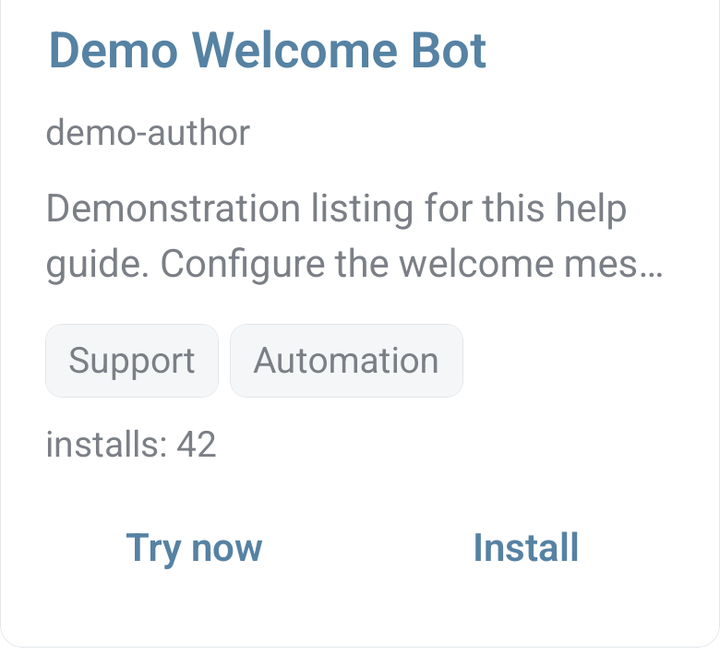
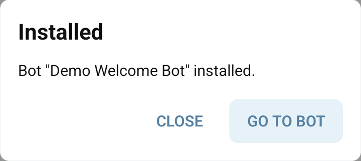

# Start from a Store bot or example

The **Store** contains complete bot examples; **Libs** contains reusable code modules. Install a bot when you want a starting project. Install a library when you need one feature in an existing bot.

## Install and inspect

1. Open **Store** in the mobile app and choose a bot.
2. Read its description, developer information and available actions.
3. Tap **Install**. [Sign in](../start/sign-in.md) if prompted, then return to the selected Store bot to install it.
4. In the **Installed** dialog, tap **GO TO BOT**, or open the installed bot later from **My bots**.
5. Inspect its commands, libraries, Admin Panel and connection settings before starting it for users. Configure your own Telegram connection where required.

The images below use a fictional Store listing to show the controls. Choose a bot currently available in your catalogue.

<figure><figcaption>A demonstration Store bot card with Try now and Install</figcaption></figure>

<figure><figcaption>The Installed dialog with GO TO BOT for a demonstration installation</figcaption></figure>

For a bot with configuration fields, open its [Admin panel](../app/admin-panel.md), save the required settings, and test the result.

Store availability and each example's setup can change. An old Telegram demo link does not prove that the corresponding Store entry is currently installable. For exportable source, review a [Git export](git.md); protected bots have different access limits.

## Welcome bot: greet a new member

The useful part of the older Welcome bot is reacting to Telegram's `message.new_chat_members` service message. In the current dispatcher, an update without command text reaches the `*` command. Create that exact command with empty **Answer** and **Keyboard** and **Wait for answer** off; a command named `/welcome` does not receive membership events automatically.

Follow the complete [Telegram updates receiver](../guides/telegram-updates.md) for the guarded welcome branch, required command setup and a group test. It handles missing usernames and preserves separate handling for contact, location and media updates. If you already have `*`, integrate its branches instead of replacing them.

Daily greetings are a separate [scheduled-command](../bjs/background.md) task: polling every 50 minutes is not a guarantee of exactly one message per day.

## Help bot: answer a known phrase

For a small keyword reply in your master command `*`:


```javascript
if (typeof message !== "string") { return; }
const text = message.trim().toLowerCase();
if (text === "help" || text === "/help") {
  Api.sendMessage({ text: "Open the help center:\nhttps://help.bots.business/" });
}
```


Expand this into deliberate rules; a substring match can accidentally answer unrelated conversation. For Telegram's inline-search interaction, use the separate [inline bot guide](../bjs/inline.md).

## Keyboard examples: contact and location

Use [Receive contacts, locations, photos and group events](../guides/telegram-updates.md) for a complete `/share` keyboard and `*` receiver. It includes the user's sharing choice, private-chat restriction, contact ownership check, location validation, saved contact/location properties and expected test results. Its media branches pass file IDs directly to the sender commands linked in the guide.

This keeps the useful scenario from SRB Demo Keyboard Tools together with the code that receives the resulting updates. A request button alone does not save a contact or location; a receiving command must handle those fields.

## BB Point Bot and other external example services

The historical BB Point Bot instructions described an external bot service with secret transfer URLs. That service's current account setup and contract are not established by the general Bots.Business code. Do not copy the old unrestricted transfer command or promise current exchange rates/extra iterations from that example.

If you already depend on it, check its current operator instructions and your account's secret/callback settings, then verify a non-production transfer path before using it. The general integration mechanism is [authenticated webhooks](../libraries/webhooks.md); a webhook alone does not prove an incoming payment or grant permission to transfer points.

For a complete numeric-input example, use the [quantity dialog](../guides/quantity-dialog.md). For ordinary mobile command editing, see [Commands](../app/commands.md).
