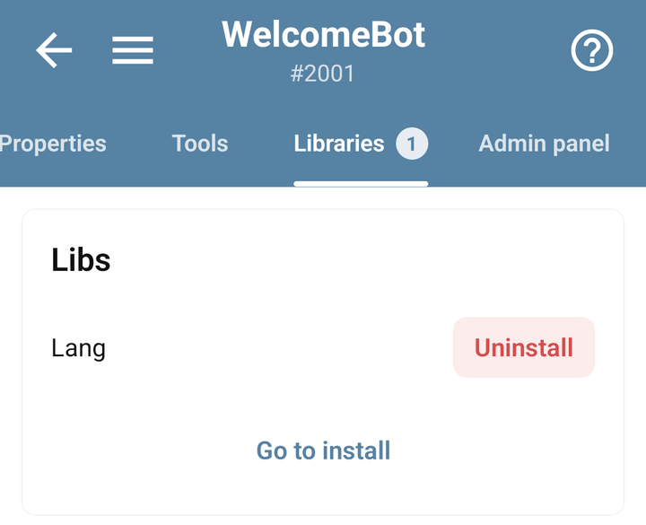
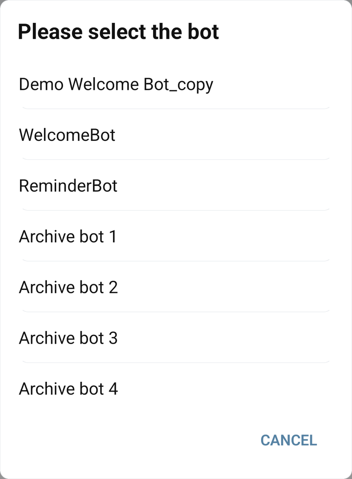

# Add reusable features with libraries

A library exposes reusable BJS functions. Use one when it solves a specific task: tracking referrals, checking channel membership, receiving a webhook, or connecting a service.

## Choose a library

| Task | Guide | Object used in code |
| --- | --- | --- |
| Numeric resources and time based growth | [Resources](resources.md) | `ResLib` |
| Referral links and tracking | [Referrals](referrals.md) | `RefLib` |
| A short leaderboard | [Leaderboards](leaderboards.md) | `TopBoardLib` |
| Display a user's name | [CommonLib helper](utilities.md#display-a-users-name) | `CommonLib` |
| Limit repeated actions | [Cooldowns](cooldown.md) | `Libs.CooldownLib` |
| Restrict administrator commands | [Guard](guard.md) | `Libs.Guard` |
| Check channel membership | [MembershipChecker](membership.md) | `Libs.MembershipChecker` |
| Receive an external request | [Webhooks](webhooks.md) | `Libs.Webhooks` |
| Translate messages | [Languages](language.md) | `Libs.Lang` |
| Template driven replies and dialogs | [SmartBot](smart-bot.md) | `SmartBot`, `SmartAmountDialog`, `SmartTasker` |
| Random values, dates and hashes | [Utilities](utilities.md) | See the individual examples |
| Accept an OxaPay test payment | [OxaPay](../integrations/oxapay.md) | `Libs.OxaPayLibV1` |

`ResLib`, `RefLib`, `CommonLib`, `TopBoardLib`, `CurrencyQuote`, `CryptoJS` and the Smart classes are provided by the runtime; no Store installation is needed for these objects.

### Short names for core libraries

| Name found in older code | Use in new code |
| --- | --- |
| `Libs.ResourcesLib` | `ResLib` |
| `Libs.ReferralLib` | `RefLib` |
| `Libs.CommonLib` or `Libs.commonLib` | `CommonLib` |

These compatibility names refer to the same core objects, so the shorter names use the same saved data. Referrals also have [direct methods replacing the old `currentUser` layer](referrals.md#older-referral-examples).

This does not apply to every installed library. Keep `Libs.Guard`, `Libs.Webhooks`, `Libs.Lang`, and the other names shown in their guides. A custom library uses `Libs.YourLibrary`; removing `Libs.` does not create a corresponding global object. Installing a library in one bot does not install it in another.

## Install and use a library

1. Open your bot in the mobile app and open **Libraries**.
2. Tap **Go to install**, choose a library, open its details, and use **Install to** followed by your bot's name.
3. Check the exact library name and dependencies in its guide. Capitalization matters: `OxaPayLibV1` is different from `OxaPayLib`.
4. Create the smallest example command from the guide and run it in your test bot.
5. Configure any required Admin Panel or external account before adding the feature to other commands.

<figure><figcaption>Libraries installed in a demonstration bot, with Go to install and Uninstall controls</figcaption></figure>

### Install from the app-wide Libs catalogue

You can also open **Libs** from the main app menu, choose a library, and tap **Install**. In **Please select the bot**, choose the intended bot and confirm the installation. Return to that bot's **Libraries** tab and check that it appears there.

<figure><figcaption>Choosing a demonstration destination bot for library installation</figcaption></figure>

When you open the catalogue from a bot's Libraries tab, the app already has that bot as the installation context. From the main Libs catalogue, you must choose the destination. Check this distinction when the library seems to be installed in the wrong place.

If the library provides settings, open that bot's **Admin panel**, fill the fields required by its guide, and save that panel. Installing code and configuring it are separate steps. The fields depend on the library; the general [Admin panel guide](../app/admin-panel.md) explains how to save and verify values.

The [official library source repository](https://github.com/bots-business/store-libs) is useful when checking a library's behavior or building your own. An installed Store library can differ from that repository snapshot; export your bot if you need to inspect the actual installed code.

## When a library is missing or behaves differently

`Libs.SomeLibrary` being undefined usually means the library is not installed for the selected bot or its name differs. Check both before reinstalling. If a dependency is missing, install that dependency too.

Removing a library removes its installed association; it does not establish that all the data it created has been removed. Search your commands and other library code for references before uninstalling it.

Need your own reusable functions? [Create a library](development.md). Need a complete starter bot? [Use a Store example](../integrations/store.md).
