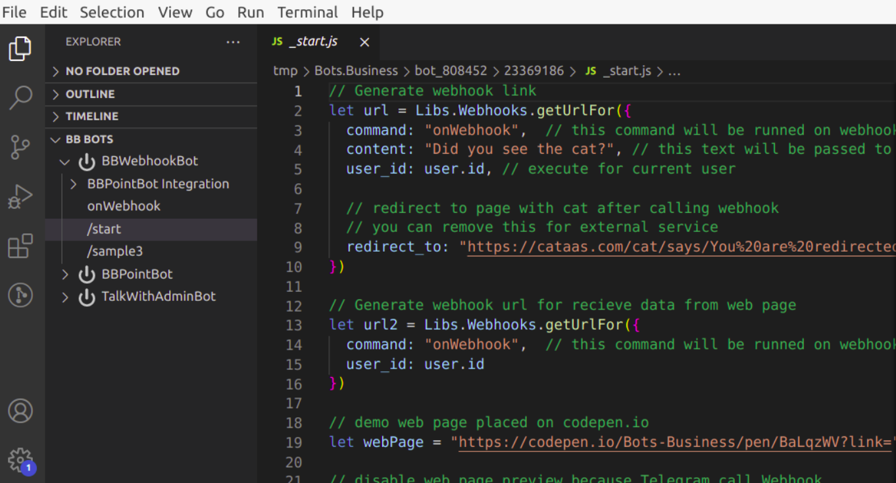

# GoogleSpreadSheet



You can post and read data from GoogleSpreadSheet with this lib.

## Demo bot




## Getting started

**1.**Make new spreadsheet. 


You definitely need a table header. Make it.

**2.** From your Google Sheet, from the _Tools_ menu select _Script Editor_

**3.** Paste the script from [above](https://gist.github.com/bots-business/b627418423a2c5df3b4ed329181077f0) into the script code editor and hit _Save._


**4.**  From the _Publish_ menu, select _Deploy as web app…_  
  
**5.** Choose to execute the app as yourself, and allow _Anyone, even anonymous_ to execute the script. \(Note, depending on your Google Apps instance, this option may not be available. You will need to contact your Google Apps administrator, or else use a Gmail account.\) Now click _Deploy_. You may be asked to review permissions now.


**6.** The URL that you get will be the webhook that you need use in this Lib. You can test this webhook in your browser first by pasting it. Note that depending on your Google Apps instance, you may need to adjust the URL to make it work. 

**`/setup`**

```javascript
// replace with your URL, obtained in step 6
Libs.GoogleSpreadSheet.setUrl("https://script.google.com/macros/*******");
```


## Using

### Add new row to spreadsheet.

command /add

```javascript
let newRow = {
  'Country': 'Italy',
  'Age': '25',
  'Do you like Bots.Business?': 'YES'
}

let prms = {
  sheetName: "Users",  // sheet name
  row: newRow,
  onSuccess: "onSuccess",  // this command will be executed on Success
  onError: "onError"       // this command will be executed on Error
}

Libs.GoogleSpreadSheet.addRow(prms)
```

### `onSucess` command

```javascript
// You can inspect options:
// Bot.sendMessage(inspect(options));

let rowIndex = options.rowIndex;
User.setProperty("rowIndex", rowIndex, "integer"); // You can set row index to options

Bot.sendMessage("Posted at row: " + rowIndex + 
    "\nInserted values: " + options.inserted);
```

### `onError` command

```javascript
Bot.sendMessage(inspect(options));
```

### Edit row.

```javascript
let newRow = {
  'Country': 'France',
  'Age': '18',
  'Do you like Bots.Business?': 'YES'
}

let prms = {
  sheetName: "Users",  // sheet name
  row: newRow,
  onSuccess: "onSuccess",  // this command will be executed on Success
  onError: "onError"       // this command will be executed on Error
}


prms.rowIndex = 3;  // row index for editing
Libs.GoogleSpreadSheet.editRow(prms);

```

### Get data from spreadsheet

Row can be changed on Spreadsheed.

```javascript
var rowIndex = 3; // row index for reading

Libs.GoogleSpreadSheet.getRow({
  sheetName: "Users",
  rowIndex: rowIndex,
  onSuccess: "onSuccessRead",
  onError: "onError"
})
```

### `onSuccessRead` command

```javascript
Bot.sendMessage(inspect(options.row));
```

