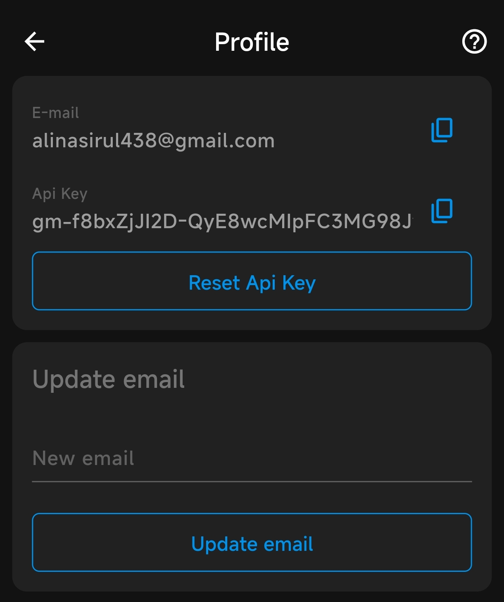
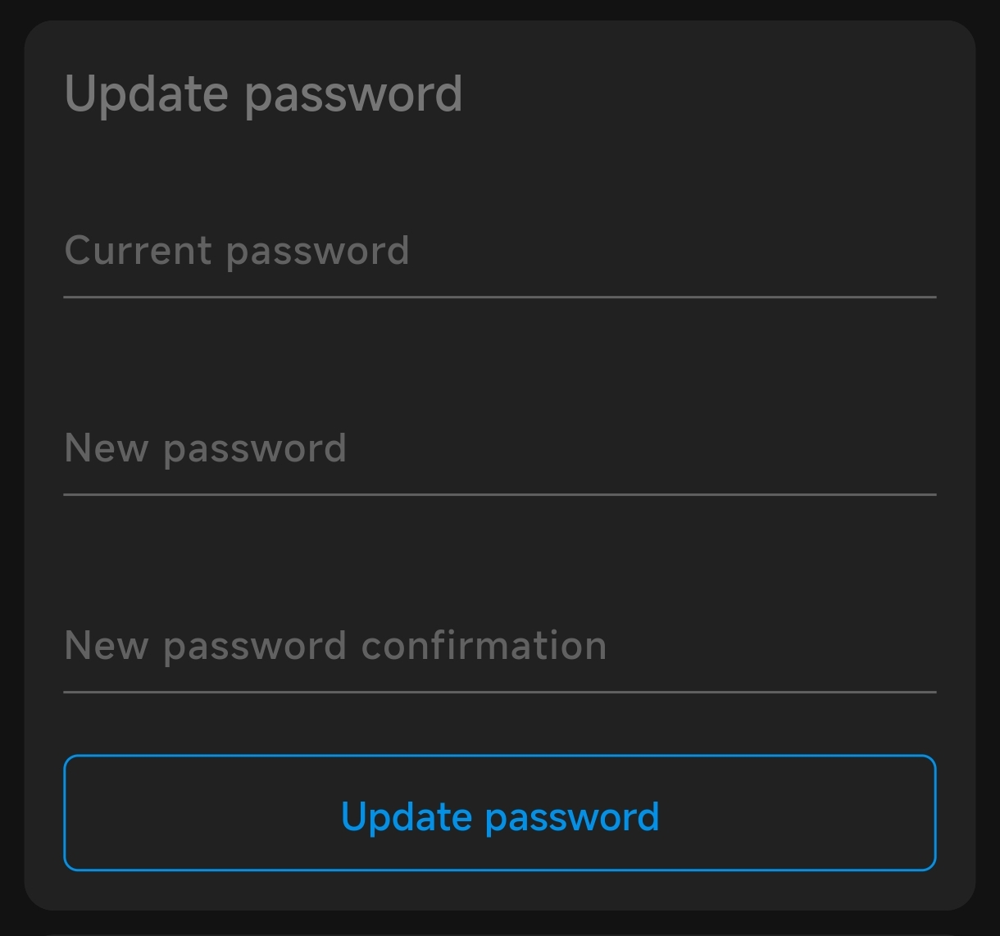
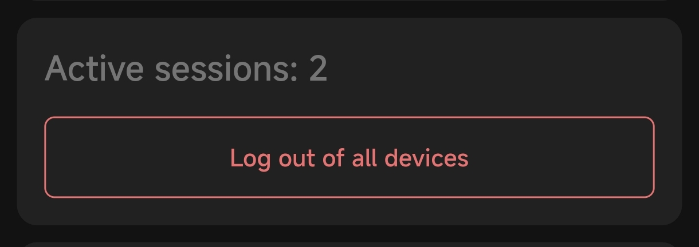
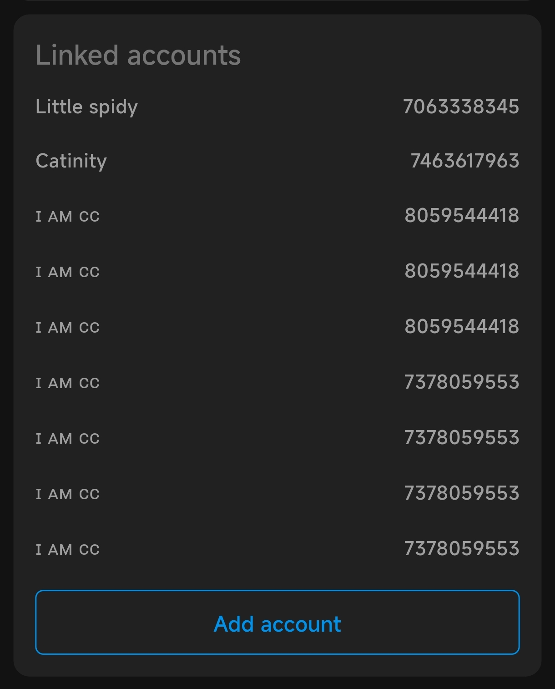

# Profile Section 

This document provides an overview of the Profile section in the Bots Business (BB) application. The Profile section allows users to manage their account settings, including email, API key, password, and linked accounts.

## Email Management

- **Update Email**: You can update your email address by entering a new email in the "New email" field and clicking "Update email".
- **Linked Email**: Your current email is displayed at the top of the screen. This email is linked to your profile and is used for notifications and account recovery.

## API Key

- **API Key**: The API key is available on the top, is used for [VS Code](vs-code.md) bot development or for creating bb app. You can copy the API key for use in your development environment.
- **Reset API Key**: If you need to reset your API key, click the "Reset Api Key" button. This will generate a new API key for your account.

## Password Management

- **Update Password**: To update your password, enter your current password, followed by the new password and confirmation. Click "Update password" to save changes.
- **Reset Password**: If you need to reset your password, [more about reset password](reset-passwors.md).

## Active Sessions

- **Active Sessions**: The number of active sessions is displayed below update password section, (e.g., 2). You can log out of all devices by clicking "Log out of all devices". This will terminate all active sessions.

## Linked Accounts

- **Linked Telegram Accounts**: All Telegram accounts linked to your profile are listed below. You can manage these accounts through the official bot [@BotsBusinessAdminBot](https://t.me/botsbusinessadminbot).
- **Add Account**: To link a new Telegram account, click "Add account" and it will redirect you to the bot and your account will be lined with bb profile.

 Currently we have bugs here, so it is possible to linked same account multiple times. but we're already on it for fixing. 

## Telegram Account Linking

- **Link Telegram**: The Profile section includes buttons for customising your experience and linking your Telegram account with the app. [Read more about account linking here](how-to-link-chat-account-with-bb-account.md).

For further assistance, please refer to the official [telegram group](https://t.me/chatbotsbusiness)
