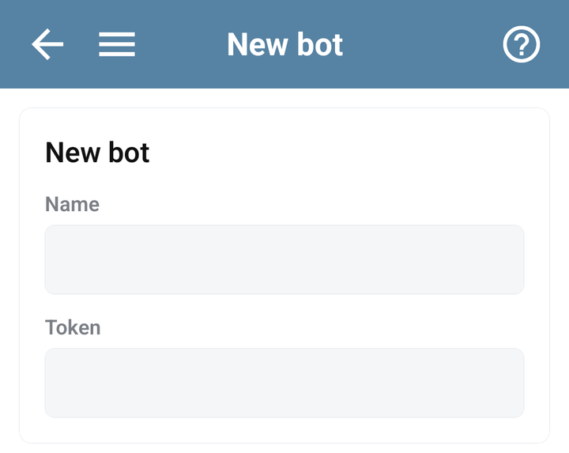
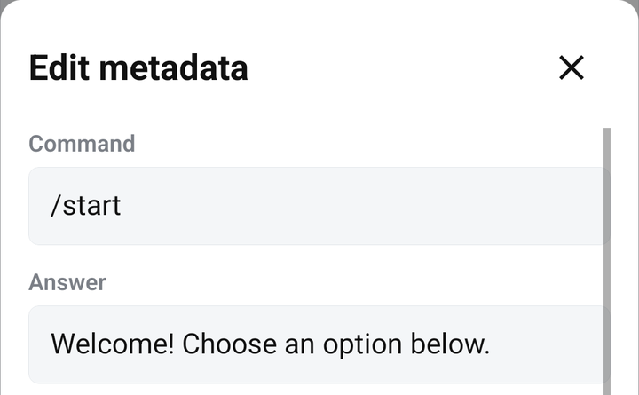
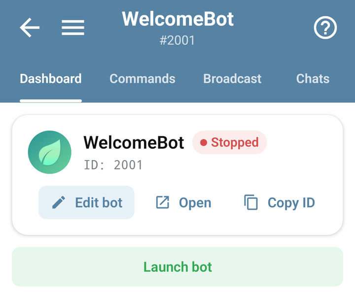

# Create your first Telegram bot

By the end of this guide, your bot will reply to `/start` in Telegram. You need a Telegram account and a signed-in Bots.Business account.

## 1. Create the bot in Telegram

Open [@BotFather](https://t.me/BotFather) in Telegram, send `/newbot`, and follow its prompts for a name and username. Copy the token it gives you. Telegram describes this process in its [bot creation guide](https://core.telegram.org/bots/features#creating-a-new-bot).

The token belongs to the bot. It is different from your Bots.Business password and account API key. Paste it only into the bot configuration; someone who has it can control the Telegram bot.

## 2. Add it to Bots.Business

1. Open **My bots** and choose **Create bot**. If the list already has bots, tap **+**.
2. Enter a useful **Name**, such as `My first bot`.
3. Paste your token into **Token** and tap **CREATE** below the form.
4. Open the new bot to enter its workspace.

A bot can be saved before its token is supplied, but it needs a valid token to connect to Telegram. If you skipped the field, open **Dashboard → Edit bot** and add it.

## 3. Give `/start` an answer

1. Open **Commands**.
2. Tap **+** and choose **New command**.
3. Set **Command** to `/start`.
4. Set **Answer** to `Hello! My bot is working.`
5. Leave **Wait for answer** off and the BJS code empty for this first example.
6. Tap **Create** in the command form. For an existing command, open **⋮ → Edit metadata**, change its fields, and tap **Edit**. The code editor's **Save** button is used for code changes.

The Answer field is enough for a simple response. You do not need to install a library or write JavaScript for this step.

The screenshot shows demonstration text. For this tutorial, keep the Answer you entered in step 4.

## 4. Launch and test

Open **Dashboard**, tap **Launch bot**, and check its status. Use **Open** to go to the bot in Telegram. Tap Telegram's **Start** button or send `/start` yourself.

You should receive `Hello! My bot is working.` Saving a command alone does not send it to a Telegram chat; sending `/start` triggers it.

## If the answer does not arrive

- Check that you opened the same bot username as the token you added.
- Check that the bot is running and the command was saved.
- Open **Errors** for the bot. Start with plain Answer text to avoid formatting errors.
- Check that **Wait for answer** is off for this example and that no group restriction is set.
- If another hosting service uses the same Telegram bot, check its connection before moving the bot between services.

Use [Bot does not reply](../troubleshooting/bot-not-responding.md) for the full checklist.

## Next: add a menu

Create a second command and [connect it to a reply keyboard](../app/reply-keyboard.md). To start programming, follow [JavaScript basics for BJS beginners](../bjs/javascript-basics.md). If you already know JavaScript, continue with [BJS execution and APIs](../bjs/README.md).
