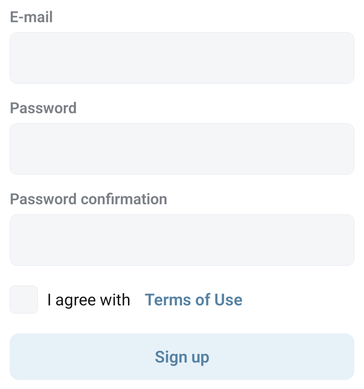
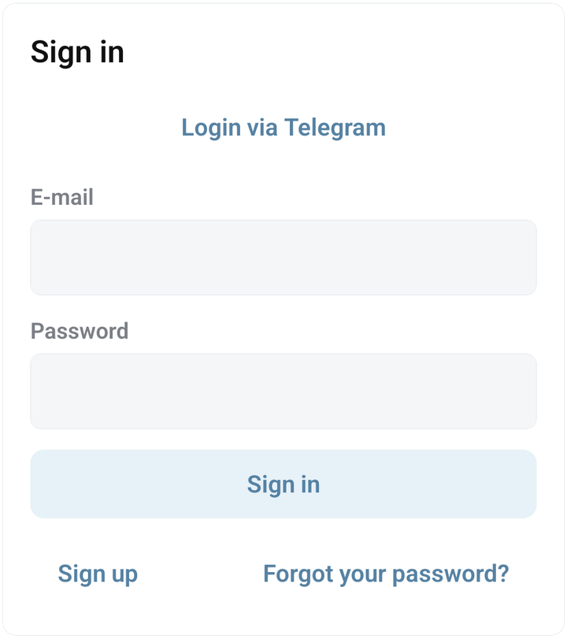
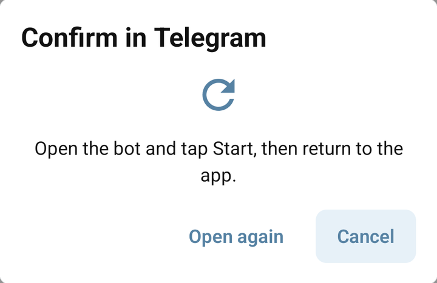

# Create an account and sign in

Sign in to Bots.Business before creating or installing a bot. Your Bots.Business account owns your projects; a Telegram bot token connects one of those projects to Telegram.

## Create an account with email

1. On the sign-in screen, tap **Sign up**.
2. Enter an email address you can access.
3. Enter a password and repeat it in **Password confirmation**.
4. Read the linked **Terms of Use** and select the agreement checkbox if you agree.
5. Tap **Sign up** and wait for the result.

If a field is rejected, correct the message shown beside it. If the email already belongs to your account, return to **Sign in** or [reset your password](../account/password.md).

<figure><figcaption>The Android sign-up fields and Terms of Use checkbox</figcaption></figure>





## Sign in with email

Enter your account's **E-mail** and **Password**, then tap **Sign in**. Use **Forgot your password?** if you cannot remember the password. Paste a bot token only into a bot's configuration, never into the account password field.

After entering the app, open **Settings → Profile** and check that the account is the one you intended to use. If My bots is unexpectedly empty, check the account before recreating your projects.

<figure><figcaption>Email sign-in and Login via Telegram in the mobile app</figcaption></figure>





## Sign in through Telegram

1. Tap **Login via Telegram** on the sign-in or sign-up screen.
2. The app opens its generated sign-in link in the official **@BotsBusinessAdminBot**. Check which Telegram account is active if you use several.
3. Tap **Start** and complete the bot's sign-in prompts.
4. Return to Bots.Business. The **Confirm in Telegram** dialog waits for confirmation and closes after a successful sign-in.
5. Check your account and bot list before editing a project.

Use the fresh link opened by your app. Opening the bot's ordinary chat without that link may not complete the pending sign-in. Keep sign-in links private.


Signing in through Telegram and [linking Telegram to an existing account](../account/linked-accounts.md) are separate tasks. If you already have projects in an email account, sign in to that account first and follow the linking guide; do not assume a different Telegram identity will open those projects.


<figure><figcaption>Bots.Business waiting for Telegram confirmation, with Open again and Cancel</figcaption></figure>





## If Telegram sign-in is stuck

| What you see | What to do |
| --- | --- |
| Telegram did not open | Check that Telegram is available; use **Open again** in the waiting dialog. |
| Still waiting after opening Telegram | Check the Telegram account, tap Start on the generated link, and return to the app. |
| Invalid or expired sign-in link | Tap **Cancel**, then **Login via Telegram** to create a fresh link. Reopening the expired link does not renew it. |
| No connection to the server | Restore the connection. The waiting dialog can retry while it remains open. |
| Too many attempts | Wait before starting another attempt. |
| You reached an account without your bots | Check the account identity; use the original email sign-in or the [recovery guide](../account/password.md). |

If you came from **Store**, sign-in can return you to the bot you selected. Confirm the installation there, then open the installed copy from My bots.

Next: [create your first Telegram bot](first-bot.md), [install a Store bot](../integrations/store.md), or [manage your profile](../account/profile.md).
