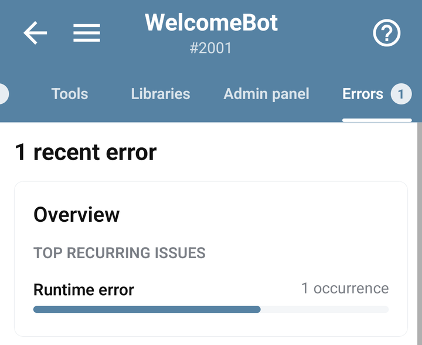
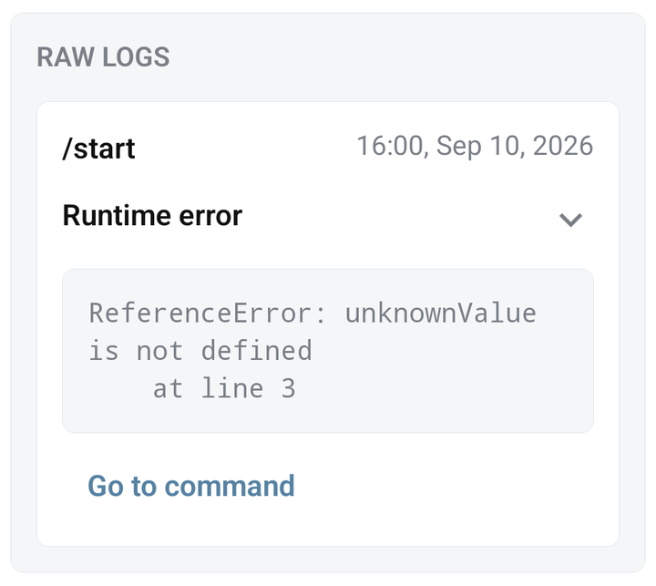

# Read errors and fix the failing command

Open your bot → **Errors**, then reproduce the problem once. Use the latest relevant error and its command context to decide what to change.

## Follow an error to its code

1. Find the error matching the time and action you tested.
2. Under **Grouped issues**, choose **Expand logs** for the relevant group and read its log entry. Use the entry's chevron if the error text is truncated.
3. Choose **Go to command** inside the log entry when available.
4. Inspect the reported line and the surrounding code. The editor can show the runtime error while you edit.
5. Save the change and repeat the same scenario. Check for a new error rather than assuming removal of an old entry proves the fix.

An error may refer to a command that has been deleted or is no longer accessible. If **Go to command** cannot resolve it, use the command name and message to investigate the current implementation. Protected bots may require the developer's help.

<figure><figcaption>The current Errors tab with grouped demonstration execution errors</figcaption></figure>

<figure><figcaption>An expanded error log with its stack and Go to command action</figcaption></figure>

## Match the error to the right check

| Symptom | Next check |
| --- | --- |
| Syntax error or an unexpected token | Check quotes, brackets, commas, and the surrounding lines; use the editor's **Check** action. |
| A method is undefined | Verify object spelling, method name, and library installation against the reference. |
| `user` or `chat` is unavailable | Check whether execution came from an incoming message, Auto Retry, a webhook, or a background callback. |
| Telegram rejects text or markup | Inspect parse mode and formatting; try plain text before restoring formatting. |
| A callback does not run | Verify its command name, required parameters, and the response/error path. |
| Timeout or growing delay | Inspect external requests, loops, repeated scheduling, and [performance](performance.md). |

## What Check proves

The editor's **Check** action checks syntax. It does not send a real Telegram request, prove that a library is installed, validate another service's credentials, or execute every callback branch.

After syntax passes, run the command in the context described by its guide. For a delayed task or HTTP request, test the callback as well as the command that starts it.

## Avoid hiding the cause

Do not wrap the whole bot in an empty `catch` or silence errors before finding their source. A custom `!` handler can report errors deliberately; its context and limitations are in [BJS error handling](../bjs/errors.md).

Keep user-facing error messages short and useful. Store or send only the diagnostic details you need; request headers and full payloads can contain credentials or private data.

## Details to provide for help

Use **Settings → Support chat** with the command, expected result, actual result, approximate time, and smallest reproducible example. Include a screenshot of the relevant error with sensitive values removed. State whether the failure is in the app, Telegram, a scheduled command, or an external integration.
